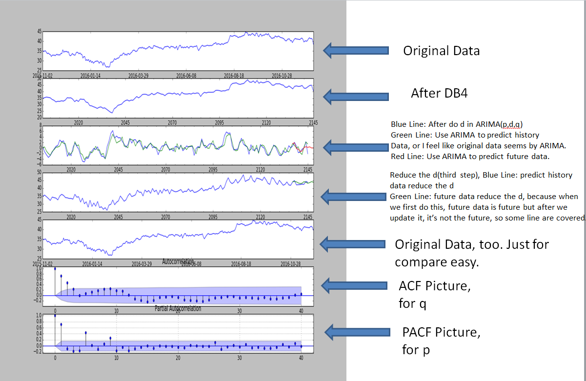
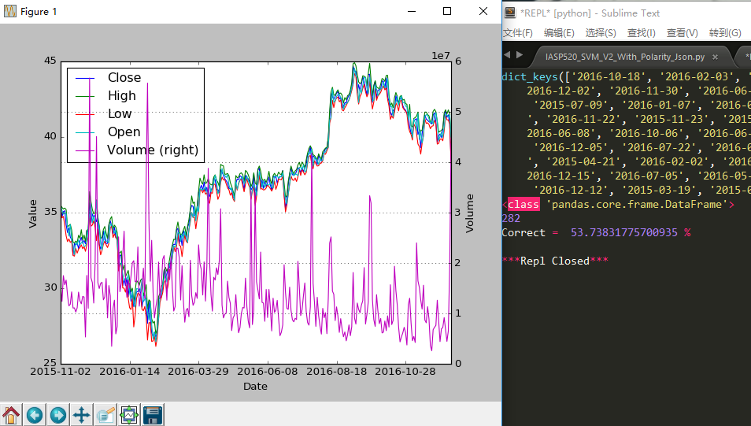

StockPrediction
=========
Stock data come from Yahoo_finance by Python.

News data come from tm.plugin by R.

ARMIA
===
Step
---
1.Use Daubechies 4 wavelet to transform the Stock Data which comes from Yahoo_finance.

2.Difference the time series make it stationary.

3.Create ACF & Pacf pictures to find out p & q which is the parameter in ARIMA.

4.Predict the stationary time series by ARIMA(p,q). Because this ARIMA package can't do difference bigger than 2, thus I don't use ARIMA(p,d,q).

5.Revert difference which we do in step 2.

|               ARIMA                |
|:----------------------------------:|
|     |

SVM
===
Not good enough. I try to transform Price to the relation, like the relation between Open & Close attributes or today & yesterday.
Stock can't be Predicted only based on history stock data, so we pull in new data. It's still not good but much better than before.

|               SVM                  |
|:----------------------------------:|
|     |
